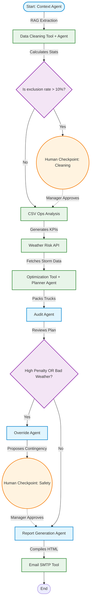

# Final Project Report: SeeWeeS Multi-Agent Dispatch System

## 1. Business Summary

The SeeWeeS specialty logistics network requires flawless execution to transport life-critical (Tier 1) and cold-chain medical supplies between Boston, New Jersey, and Philadelphia. The baseline dispatch system struggled with two major operational risks:
1. **Dirty Data:** Missing tracking numbers, legacy vendor codes, and brand-name substitutions routinely caused bottlenecks in the warehouse.
2. **Infinite Capacity Fallacy:** Dispatch planners assumed unlimited trucks and drivers, leading to severe SLA violations and mathematical penalty points when resources inevitably ran out.

**The Multi-Agent Solution:**
We deployed a LangGraph-based AI system that acts as an autonomous logistics department. It pairs the deterministic mathematical accuracy of Python with the strategic reasoning of LLMs. 
- A **Data Cleaning Tool** instantly cross-references the 14-day shipment log against the canonical Item Master Appendix, fixing typos and generating missing IDs to ensure 100% data integrity before planning begins.
- A **Heuristic Optimization Engine** mathematically packs shipments into a limited pool of temp-controlled and standard trucks, prioritizing Tier 1 and Cold-Chain items. If resources are exhausted, it automatically delays Tier 2 items and calculates the exact SLA penalty incurred.
- An **Audit & Override Safety Loop** acts as an AI guardrail. If the mathematical optimizer proposes sending a driver into a Category 3 hurricane just to avoid an SLA penalty, the Audit Agent rejects the plan and routes the system to an Override Agent, which drafts a "Safety First" contingency plan for a human manager to approve.

This hybrid approach guarantees zero mathematical errors while maintaining human-in-the-loop safety oversight.

---

## 2. Technical Summary

The architecture is built on **LangGraph (`StateGraph`)**, utilizing a centralized `AppState` dictionary to pass data (DataFrames, JSON, and strings) between specialized nodes. The system successfully implements all five of the project's complex Focus Areas:

1. **Deterministic Tooling (Data Cleaning & Optimization):** 
   Instead of asking an LLM to "guess" the math or run RegEx, we built pure Python functions (`src/tools/data_cleaning_tools.py` and `src/tools/optimization_tools.py`). The LLM Agents merely read the outputs of these deterministic functions to generate executive narratives.
2. **Conditional Routing (The Audit Loop):** 
   The `AuditAgent` inspects the output of the planner. Using `add_conditional_edges()`, the graph forks. If `total_penalty > 100` or `weather_risk == 3`, the flow is diverted to the `OverrideAgent`.
3. **Human-in-the-loop Checkpoints:**
   Using LangGraph's `MemorySaver` checkpointer and `interrupt_before` logic, the pipeline completely pauses execution during high-risk events (e.g. data exclusion rates > 10%, or when a Safety Override is proposed). The execution halts in the terminal and waits for `sys.stdin` confirmation from the human manager before resuming the graph.
4. **What-If Scenario Simulation Entrypoint:**
   A separate `src/what_if_main.py` entrypoint was built. A `WhatIfAgent` takes natural language prompts (e.g. *"What if 3 drivers call in sick?"*), outputs strict JSON, and triggers a Python script to temporarily modify the Pandas DataFrames in memory, allowing managers to stress-test the Optimization engine against hypothetical disasters.

---

## 3. Agentic Graph Architecture Diagram

The flowchart below visualizes the nodes and conditional edges of the LangGraph state machine.

